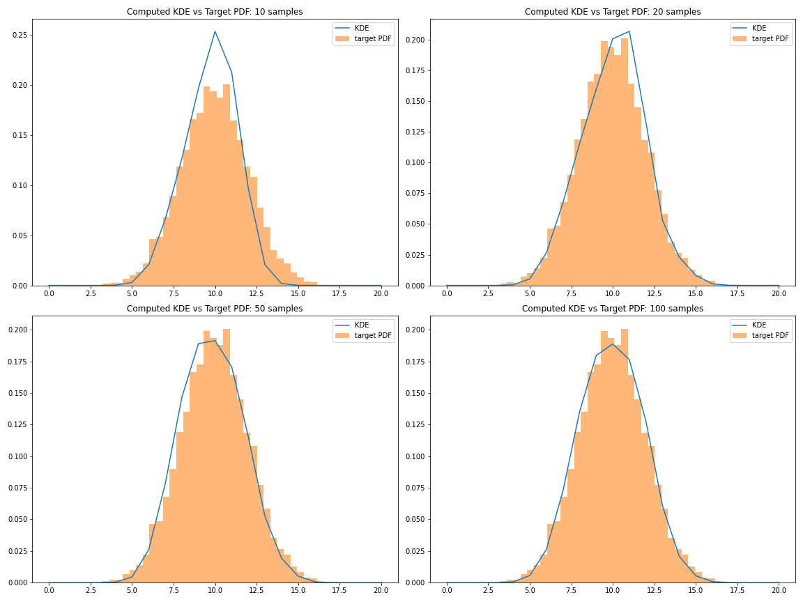

## Team 5: The Pitts 💪

### Core Responsibilities
Foraging (relating to stCRD) and environment/natural disasters (relating to ltCRD)

### Team Members

| Rep | Name      | Shortcode | Github ID |
| - | --------- | --------- | --------- |
| Design | Semina Mertzani | sm420 | amertzani |
| Infra | James Teversham | jt2220 | JamesTev |
| Infra  | Philippos Arkis Hadjimarkou | ph720 | P-A-Ha |
| | Anh Nguyen | an2820 | anhnguyen24 |
| | Justin Ma | jm3820 | justma360 |
| | Catherine Chaya | cc5820 | catherinechaya |

## Agent Strategy

## Judge
- Return a pointer to our client if we get elected
- Keep the rest of the functions (don't implement them)

## Speaker
- Return a pointer to our client if we get elected
- Keep the rest of the functions (don't implement them)

## President 
- The President role contains the following functions:
        - GetClientPresidentPointer():
            - This is used to indicate that we are taking the role of the President
        - EvaluateAllocationRequests()
            - Here we are taking the sum of all available requests and running them through various logic. Essentially we are deciding whether or not we will allocate CP requests, depending on the size of the request and the size of the CP. If the total of the requests is smaller than 0.8 times the size of the CP, then we allocate resources. If it's between 0.8 and 1 times the CP, we divide requests by two and then allocate them. If they are higher than that then we return a fraction of those resources to everyone, keeping the CP dynamics in order. It will be interesting to see how agents responds to getting less resources that they requested.(More supporting arguments to these) 
        - PickRuleToVote()
            - This was left as default for the agent's MVP
        - SetTaxationAmount()
            - Set Taxation Amount was based on a fair division of resources. As the point of the game was to survive, we would set a tax rate proportional to the resources an island has. 
        - PaySpeaker()
        - CallSpeakerElection()
        - DecideNextSpeaker()
        - minmaxOpinion()

## IIGO Compulsory
- Monitor Rules => naively always monitor all rules

## Foraging
Intial Forage 
- At first (X rounds) we forage based on which class of wealth we are in.
- Where JB = Deer, Middle = 50/50 Deer/Fish, Imperial = Fish, Dying = All on deer (as we are close to dying we can invest into a riskier option)
- Store all information regarding the previous investments and returns. Which includes the investments and returns of other islands.
- TBA: account for the amount of resources we consume each day due to daily consumption and adjust our inputs according to how much we use (as we want a minimium return of the amount we are using per day)

After the initial rounds we return to regular foraging

The first thing our agent does is look at the history of foraging
- It then chooses the type of foraging that had the best return on investment  which is (output/input)-1. 
- After which is looks at the previous round to see how many people went hunting or fishing. Increasing its probability of that type based on the number of participants.
- It then looks at the number of deer hunters in the previous X rounds (not inlcuding the previous round). From that it will decrease its probability of going hunting, as if there are too many hunters in the previous X rounds then theres a chance the Deer population will be low.
- The probabilites for the previous rounds are finalised and combined with the method with the best RoI.
- A Brunelli distribution is built with the finalised probabilties, with some added randomness the final method is selected. (With this our agent is not always selecting the best type and there is some randomness and incooperation of the other islands previous expeditions)


Normal Foraging 
- It takes the final foraging method from above.
- It then looks at the history and finds the input, for that method, that gave the best RoI. 

Case -1: No foraging method gave positive RoI
- The agent will skip foraging for 1 turn 
- If the agent has already skipped last turn it will then be forced to forage, randomly with half the amount of resources it would normally go with (in hopes it finds a good RoI)

Case 1: A method has positive RoI
- Adds a random amount % of our wealth to the Best Input. 
- Compares the new Best Input to the threshold maximium of our wealth. Capping it at the maximium % of our total wealth 
- Returns foraging method and input

Updates its history onces it recieves its return 
Stores the history of other islands 
 

#### Conservative approach 
If other islands are selfish and less likely to help 
Go into fish hunting more often with just enough resources. When there's a stable income then up the amount entered.

#### Aggressive approach 
Go into deer hunting more often ( 2 out of 3 times) Investing more resources. 
(Dependant of the response of other islands if they help islands that are about to die)

## IIFO and Disasters
IIFO implementation covers making disaster predictions/forecasts based on a history of disaster observations and predictions from other teams. 

### Basis of Forecasts
The forecasting implementation generates forecasts based on several factors as explored below.
#### Experience
Most importantly, we use our past observations of disasters that occurred (in `disasterHistory`) to inform our current and future forecasts. Forecasts attempt to predict the following characteristics of a disaster:
- **(x,y) co-ordinates** of disaster epicentre
- **magnitude** (severity) of disaster
- **period** - the time between successive disasters. For a given forecast, this will involve predicting the time until the next disaster.

In predicting the coordinates and magnitude, our simple first approach is to simply average these variables across past disasters. The confidence score associated with these predicted variables takes into account two factors:
- number of observations (more observations => higher confidence)
- variance in observations (more variance => lower confidence)

The period is predicted in a similar but slightly different manner. There are two cases:
- 1 past disaster: best we can do is to predict that the next disaster will have the same period. Confidence here is aribtrarily low - say 50%.
- Many past disasters: analyse the variance in the period of past disasters. Select the predicted period as the mean period of these past observations with confidence calculated on the following basis:
    - Compare the calculated period variance $\sigma$ against a variance threshold $\sigma_{thresh}$ to get a variance ratio $r$: $$r = \text{min}(\sigma/\sigma_{thresh}, 1)\;, \quad r\in[0;1]$$ Then, confidence is maximised when $r=0$ (corresponding to zero variance in periods of previous observations). Conversely, $r=1$ corresponds to minimum confidence as the calculated variance exceeds the threshold: $\sigma \geq \sigma_{thresh}$. The variance threshold $\sigma_{thresh}$ is a parameter and may be chosen to be some fraction of the mean period - perhaps half the mean period.

The final prediction combines the coordinate and magnitude prediction with that of the period. The combined prediction confidence is computed as a weighted sum of the coordinate+magnitude prediction and the period predition. Typically, more weight will be given to the period prediction as it is slightly easier to predict.

#### Collaboration
The other important component of forecasting is incorporating forecasts from other teams. In each turn, we will receive all forecasts offered to us from other teams (a subset of all teams). A aggregated/collaborative prediction is then formed by computing a *weighted* average based on the following weighting factors for each team:
- confidence of the team's forecast
- our current opinion of the team. Specifically, our record of their *forecasting reputation* (explored more below).


### Role of Opinions in Forecasting
Mention:
- forecasting reputation ($\in[-1, 1], \in \mathbb{R}$). Necessary to differentiate from broad opinion score since a team might be stingy with gifting but skilled at forecasting and so we'd still want to use their knowledge.
- we only consider forecasts from *trusted* teams - those with forecasting rep >= 0 (neutral rep as minimum).
- which factors we use to determine another team's forecasting reputation. Possible options:
    - If they make a nonsensical prediction with over 50% confidence before any disasters have occurred, decrease their reputation by 0.5
    - If they make any predictions with 100% confidence, decrease their reputation to -1.0. It is not possible to be certain.
    - If they predict the turn on which a disaster occurs within some tolerance, increase their rep:
        - exact turn: +0.4
        - +- 1 turn: 0.2
        - +- 2 turn: 0.05
    - If they *accurately* predict coords and mag. within some margins, increase their rep:
        - increase proportional to % more accurate than mean estimates


## IITO
###  Gifting 
SIMP-le agent
Gift 1 resource to every agent when we are in the middle class and the 

```go
OurRequest   map[uint]giftInfo
type giftInfo struct {
	requested      shared.GiftRequest   - GetGiftRequest - Amount WE request
	offered        shared.GiftOffer     - GetGiftResponse - Amount offered TO US 
	response       shared.GiftResponse  - GetGiftResponses - Amount WE accepeted and reason
	actualRecieved shared.Resources     - ReceivedGift - Amount WE actually received 
}	
	
TheirRequest map[uint]giftInfo
type giftInfo struct {
	requested      shared.GiftRequest    - GetGiftOffers - Amount THEY requested 
	offered        shared.GiftOffer      - GetGiftOffers - Amount WE offered
	response       shared.GiftResponse   - UpdateGiftInfo - Amount THEY accepeted and reason
	actualRecieved shared.Resources      - DecideGiftAmount - Amount THEY actually get
}
```

## IIGO
### Common Pool
- Don't contrib. if threshold has been met
- Dependent on the current resource level and compared to the probability of disaster
- Change resource level if disaster is about to happen (according to our forecast)?
- Contribute after we go foraging 

#### Request from President
- Submit a request to the President to take away cp resource  `CommonPoolResourceRequest()`
- Keep a history of resources requested and allocation 
- If we are in turn 1 season 1 request amount equal to `imperialStudent`
- If we get accepted yesterday, we’ll increase the amount requested today
    - Otherwise, we’ll decrease the amount
- If we fall out of middle class, we'll request whichever one is higher
    - 1/6 of `currentCP` or
    - `imperialStudent`
#### Request from Common Pool (ie, take away resource in cp)
- Take away the amount equal to the `c.allocation` approved by President using `requestAllocation`
- If we fall out of middle class, regardless of President's allocation, we will take either
    - 1/6 of `currentCP` or
    - `imperialStudent`
- That means we may face sanction for stealing 

#### Contribute to Common Pool
- Keep track of the history of the resource amount in the common pool
- In `turn = 1` and `season = 1`, we don't contribute anything due to lack of knowledge
- If we fall out of middle class, we will not contribute
- Otherwise, see whether islands are contributing or not
    - if amount of resources was increased during the last 2 rounds
        - `contribution` = average contribution of others (amount of increase in the cp/6)
    - if not => not contribution to the common pool (only pay tax)
    - 
### Tax
- If we are in status `imperialstudent` or dying tax= 0
- If turn 1 season 1 = 0.5*`tax_amount` (just a little bit so we don’t get into trouble)
- Otherwise = `tax_amount`

**Notes**: don’t have to pay tax. Tax is distributed to IIGO officials (president, speaker etc) so if we don’t pay for an extended period, we may face sanctions (check this?). ...TB added
if an island does not pay tax, it will get an economical sanction (pay X amount), the sanction  will be decided by the judge. The judge choses in which tier you are in (severity)

**Level 2 (Future works):** 
- Compute the probability of getting a sanction greater than the tax and based on that choose whether we evade tax.
- A future implementation would be to not pay any tax if you hold the role of the judge. as we would not receive any sanctions.
These of the two following steps to take into consideration: 
    - implement not paying tax if we are the judge
    - implement in the role of the judge to not penalise Team 5 for not paying tax but penalise the rest


### Sanctions
- always pay the sanction 

## IIFO

## Opinion Formation
An opinion of another island is our general perception of it and is characterised by a score between 1.0 (highest/best perception) and -1.0 (worst/lowest perception). Potential events that may
 affect our opinion of other teams:
 - allocating/distributing less than they initially offer for gifting
 - hunting deer when the population is below critical population
 - corrupt IIGO roles
 - others?

An opinion is implemented by the following type. A struct is chosen so that we reserve the ability to add other possible attributes that influence an opinion (besides just a score). Perhaps, the max/min historical score.
```go=
type opinion struct {
	score opinionScore // May want to define other attributes in future
    
type opinionMap map[shared.ClientID]opinion // opinions of each team

// history of opinionMaps (opinions per team) across turns
type opinionHistory map[uint]opinionMap // key is turn, value is opinion
}
```

Then, opinions per team are stored in an `opinionMap`. Finally, a history of our opinions per team across time (turns) is stored in an `opinionHistory` type.

We intend to store an opinion of our own team in this `opinionMap`. This is so that we can adjust our opinion of ourselves based on the same measures that we use to form opinions of other teams. This could be interesting in analysing how our agent performs given its 'behaviour'(essentially what our opinion of it would've been if it was another agent). 

#### Opinion for a role:
On top of this, we decided to add an opinion towards a team implementing a role. Thus we compute the total budget spent by the 3 roles. 
We compare it to the maximum amount that could have been contributed by the alive islands to taxation. If the budget spent is greater that the taxation then we are affected negatively seems these roles are spending more. In this way, since we are facing a collective risk dilemma, we are less protected from disaster. In the opposite case, we are affected positively. We would like to mention here that we are aggregating the total budget spent because the one role decides on the budget of the other. So, it can be that they might be all corrupt and decide on higher salaries.

Futhermore, The teams scores will be sorted and ranked.They are sorted using the following function `sort.Slice()` which can store custom types. After sorting the teams, we will compare the new rank with the old one and their indexes(position) to establish which we trust more.

### Estimation

A KDE (kernel density estimation) implementation is used to learn the distribution of random quantities from our experience. These may include learning the distribution of:
- period, magnitude and spatial distribution for *disasters*
- sizes of fish/deer in *foraging*. Perhaps also the prevalence - chance of catching. 

Computed KDE estimates for a normal distribution for varying number of (KDE) samples are shown in the plot below. This demonstrates the efficacy of the implementation.




### Future Work:

We know that the taxation is a combination of the role's budget and its salary.
In order to evaluate whether role is corrupt or not, a future implementation would be to evaluate a role based on the combination of their budget and their salary and whether they exceed one third of the total taxation amount. As a matter of fact, the summation of all three budgets and salaries should be less or equal to the total taxation amount contributed into the common pool. In addition, we could later evaluate a role based on their given budget and their cost of action. Whether this role exceeds its budgets and take advantage of the open access to the common pool.

++budget (`IIGORolesBudget`)
++salary (`salary shared.resources`)


