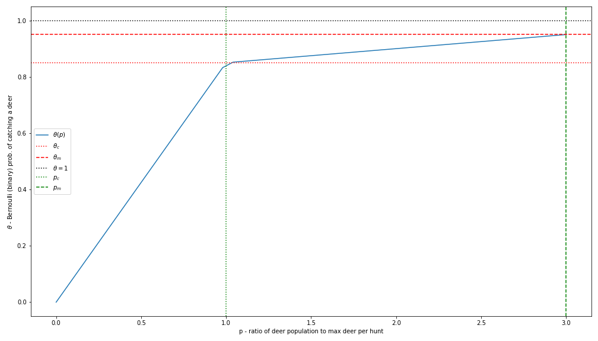

## Foraging
*note*: GH doesn't support LaTeX in MD file previews. View this file locally in VSCode or similar to see the maths.
### Deer Hunts 🦌

#### Utility for a single deer
The return for a single deer is modelled as a random variable that is implemented as `deer_return()`. It is effectively the combination of two other RVs:
- `D`: Bernoulli RV that represents the probability of catching a deer at all (binary). Usually `p` - i.e. P(`D`=1) = `p` - will be fairly close to 1 (fairly high chance of catching a deer if you invest the resources)
- `W`: A continuous RV that adds some variance to the return. This could be interpreted as the weight of the deer that is caught. W is exponentially distributed such that the prevalence of deer of certain size is inversely prop. to their size.

D and W are combined in the following expression: $H = D(1+W)$ (another RV which is the output of `deer_return()`). Notice how `W` is irrelevant if `D`=0 (weight of a deer does not matter if we don't catch it). Also, the mean return can be shown to be $E[U] = E[D(1+W)] = p(1+E[W]) = p(1+\frac{1}{\lambda})$ where $p$ is the Bernoulli parameter of `D` and $\lambda$ is the rate parameter of `W`

#### Dynamics of a collective hunt
A deer hunt is modelled as a stochastic process where the expected utility is proportional to input resources provided for the hunt. There is no limit to the number of teams `m` that can join a hunt, however there is a limit to the number of deer `n` that can be hunted in a single hunt. `n` should be chosen s.t. `n < max(m) = 6` so that beyond a certain number of hunters, the utility per team decreases as the same expected return could be achieved with less hunters. 

The utility distribution is modelled as being agnostic to the number of hunters; it only depends on the collective amount of resources invested in the hunt. Furthermore, assume the minimum resources to hunt a single deer is $\theta$. We use the (naive) assumption that hunting one deer is independent to another and let the expected return for a single deer be $E[U]=\mu$. Then, for a given real-valued collective resource input $x$ (across all hunt participants), the expected return is proposed as follows:

$$
U_{\theta}=\left\{\begin{array}{ll}
\mu & x \in[\theta ; 2 \theta) \\
2 \mu & x \in[2 \theta ; 2.75 \theta) \\
3 \mu & x \in[2.75\theta ; 3.25 \theta) \\
4 \mu & x \in[3.25\theta ; \infty)
\end{array}\right.
$$

where the maximum number of deer that can be hunted in a single hunt is 4. Notice that the expected return for $n$ deer is simply $n$ times the return of a single deer (i.i.d. assumption). *However*, the incremental input resources required to hunt $n$ deer decreases as $n$ increases. That is, it costs less (per deer) to hunt more deer, this is to incentivise collaboration. This dynamic is incorporated using a variable $\Delta$ (decay = gameConf.ForagingConfig.IncrementalInputDecay) which is the rate of decrease as the number of deer's being hunted ,$n$, increases. For each additional deer the additional cost need to hunt it is calculated by $\Delta^n$ thus decreasing if the $\Delta < 1$ and increasing if $\Delta > 1$. 

Assuming $\Delta=0.8$ for the MVP 
$$ \text{Increments\ of\ catching\ n\ deer}=
\left( \begin{array}{ll@{}}
n=0: \Delta^0 = 1 \\
n=1: \Delta^1 = 0.8^1 \\
n=2: \Delta^2 = 0.8^2 = 0.64 \\
n=2: \Delta^3 = 0.8^3 = 0.512 \\
n=4: \Delta^4 = 0.8^4 = 0.4096\\ 
\end{array} \right) $$
The minimum amount of resources needed to hunt $n$ deer can be calculated as the cumulative cost, represented by 
$$ 
\sum_{n=0}^{n} \Delta^{n} = \Delta^{0} + \Delta^{1} + \Delta^{2} + \Delta^{3} + \Delta^{4} + ....
$$
Where $n$, the number of deer you can hunt, is determined by the amount of resources input to the system.

### Dynamics between deer population and likelihood of catching a deer

We need to devise a mapping between the instantaneous deer population $P(t)$ and the binary probability of catching a deer $\theta$ (regardless of its size). Clearly, $P(t) \propto \theta$ - more deer leads to a larger chance of catching a deer. The task remains to mathematically characterise this relationship. 

Consider 
- $p \in [0, p_{max}]$ - deer population ratio: ratio of running population $P(t)$ to max deer per hunt. $p_{max} \in \mathbb{N}$ is the maximum ratio. For example, if max deer per hunt is 4 and carrying capacity is 12 (max population), then $p_{max} = \frac{12}{4} = 3$.  
- $\theta \in [0, \theta_{max}], \; \theta_{max} \leq 1 $ - binary prob. of catching a deer
- $p_c$ - critical population ratio. Will usually equal 1 (the case where the current deer population = max number of deer per hunt). Below this, we are guaranteed to catch less deer than max number per hunt.
- $\theta_c$ - critical probability value. This is the proability of catching a deer when $p=p_c$

Now, we need to define a function $f = \theta(p)$ that maps $\theta$ to $p$ such that the probability of catching a deer is linked to the population. Consider

$f=\begin{cases} 
      f_1 = \theta_c p & p \in [0; p_c] \\
      f_2 = \alpha(p-p_c) + \theta_c & p \in [p_c; p_{max}]
\end{cases}$
where $\alpha = \frac{\theta_{max}\; - \; \theta_c}{p_{max} \; - \; p_c}$

This mapping function is plotted below:

